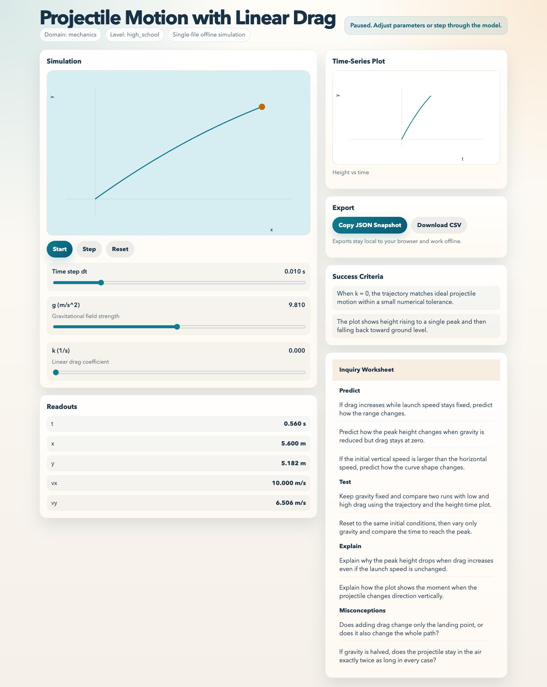
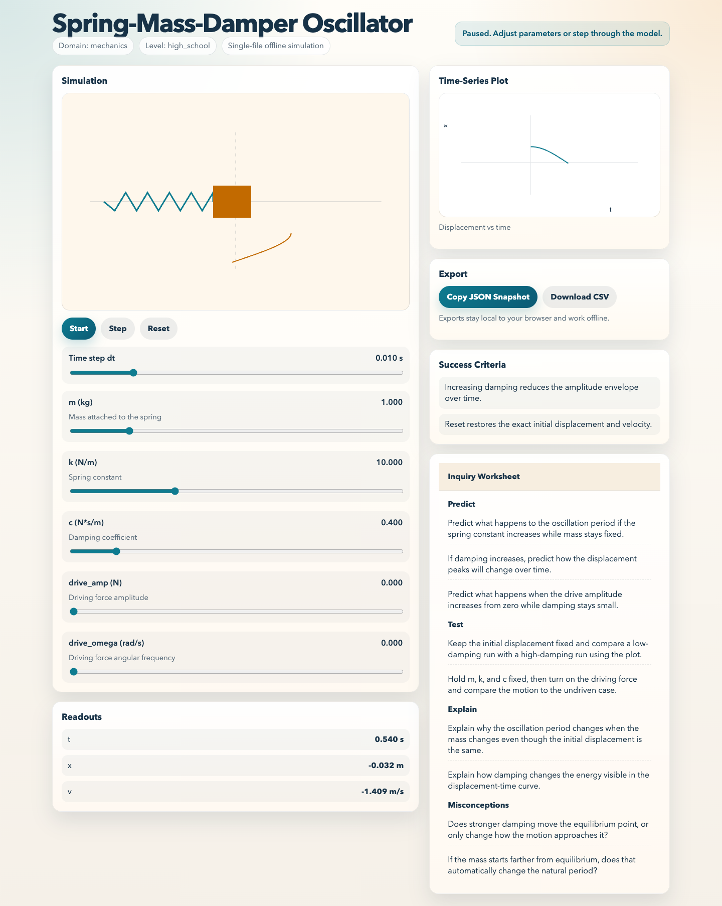
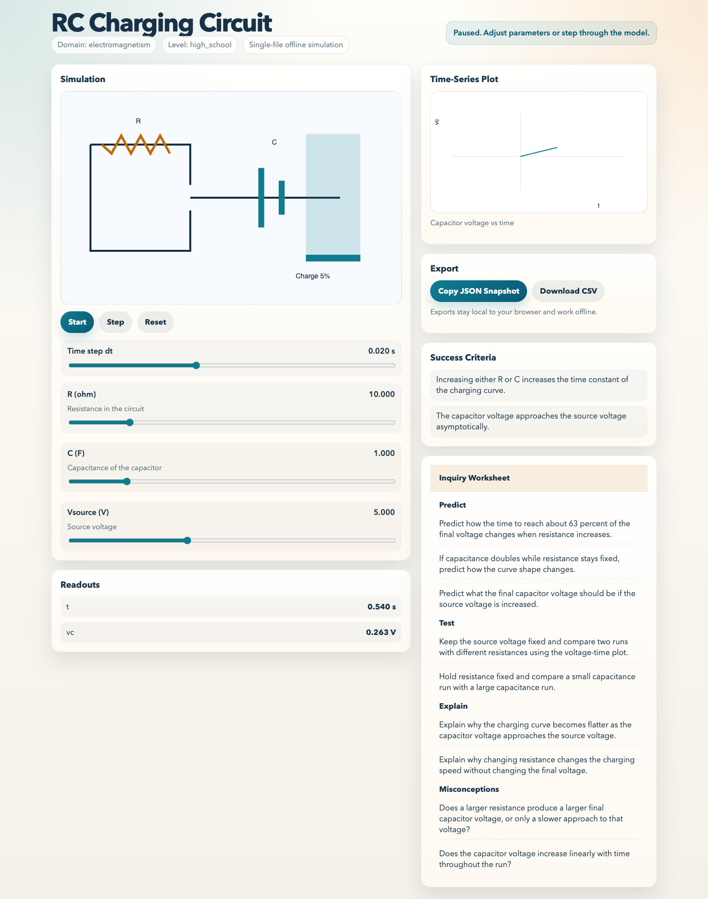

# Science Simulation Author

<p align="center">
  
  
  
  
</p>

<p align="center">
  <a href="https://doi.org/10.5281/zenodo.18822554"></a>
</p>

<p align="center">
  Generate self-contained interactive STEM simulations from a compact SimSpec.
</p>

<p align="center">
  Single-file HTML. Offline-first. Canvas-based. Classroom-ready.
</p>

---

## What It Is

Science Simulation Author is an OpenClaw skill bundle that turns a small YAML or JSON SimSpec into a single `index.html` interactive simulation. The generated output is designed to run offline, expose model parameters as sliders, plot time-series data, and include inquiry prompts for teaching and exploration.

The current v1 supports:

- projectile motion with optional linear drag
- spring-mass-damper systems
- RC charging circuits

## Why It Exists

Most classroom and demo simulations fall into an awkward gap: too simple for a full app stack, too dynamic for static content, and too fragile when they depend on build steps or remote assets. This project targets that gap with a strict contract:

- exactly one generated `index.html`
- no bundler
- no external CDN
- no runtime network dependency
- safe-by-design authoring rules

## Screenshots

<table>
  <tr>
    <td></td>
    <td></td>
    <td></td>
  </tr>
  <tr>
    <td align="center"><strong>Projectile with drag</strong></td>
    <td align="center"><strong>Spring-mass-damper</strong></td>
    <td align="center"><strong>RC charging circuit</strong></td>
  </tr>
</table>

## Repository Layout

```text
.
├── README.md
├── LICENSE
├── CITATION.cff
├── docs/
│   └── images/
└── science-sim-author/
    ├── SKILL.md
    ├── agents/openai.yaml
    ├── examples/
    ├── rubrics/
    └── templates/
```

The GitHub-facing files live at the repository root. The OpenClaw bundle remains isolated inside `science-sim-author/` so GitHub presentation and ClawHub publishing stay separate concerns.

## Skill Highlights

- SimSpec-driven generation from YAML or JSON
- RK4 default integrator with Euler fallback
- canvas rendering and built-in plotting
- parameter sliders and fixed-step simulation controls
- JSON snapshot export and CSV time-series download
- inquiry worksheet sections for Predict, Test, Explain, and Misconceptions
- offline execution by double-clicking the generated file

## Validation Status

The current bundle has been checked with:

- schema validation for all example SimSpecs
- generated HTML render sanity checks
- browser smoke tests in Chrome, Firefox, and WebKit
- file-protocol fallback verification for offline clipboard behavior
- OpenClaw skill validation

Smoke artifacts are available in `output/playwright/` in the working tree used during development.

## Using The Skill

The publishable skill bundle lives in [science-sim-author/](science-sim-author/). The primary skill contract is in [science-sim-author/SKILL.md](science-sim-author/SKILL.md).

Typical input includes:

- simulation title and domain
- state variables
- tunable parameters
- initial conditions
- derivative equations
- desired plots or trace outputs
- worksheet prompts or success criteria

Typical output is one `index.html` file that can be opened directly in a browser.

## Cite This Project

This repository includes a [CITATION.cff](CITATION.cff) file so GitHub can expose a "Cite this repository" action once the project is pushed to GitHub.

If you use this work in research, teaching materials, or software projects, cite the repository version you used.

- Concept DOI for the project: [10.5281/zenodo.18822554](https://doi.org/10.5281/zenodo.18822554)
- Archived release DOI for `v0.1.4`: [10.5281/zenodo.18822711](https://doi.org/10.5281/zenodo.18822711)

Suggested citation flow:

- cite the concept DOI when you want to reference the project as an evolving software artifact
- cite the version DOI when you want a fully frozen, reproducible archived release

## License

This repository is released under the MIT License. See [LICENSE](LICENSE).
